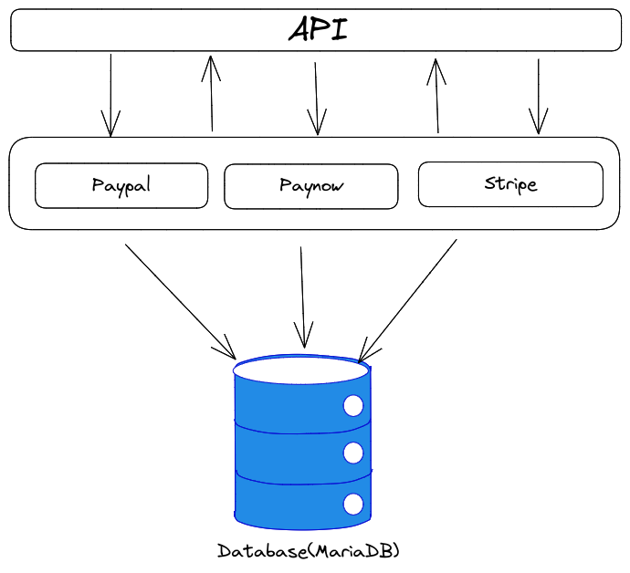

# Papapi

Papapi is a simple, fast, and powerful microservice for **Paynow, PayPal and Stripe** payments.

# Table of contents
1. [Supported Method](#supported-payment-methods)
2. [Tech Stack](#tech-stack)
3. [Architecture](#architecture)

4. [Installation](#installation)
    - [Add a user](#add-a-user)
    - [Get a token](#get-a-token)
    - [Making authenticated requests](#making-authenticated-requests)
5. [Paynow](#)
    - [Configuration](https://github.com/takumade/papapi/blob/main/docs/paynow/CONFIG.md)
    - [Payments](https://github.com/takumade/papapi/blob/main/docs/paynow/PAYMENTS.md)
    - [Webhooks](https://github.com/takumade/papapi/blob/main/docs/paynow/WEBHOOKS.md)
6. [PayPal](#)
    - [Configuration](https://github.com/takumade/papapi/blob/main/docs/paypal/CONFIG.md)
    - [Payments](https://github.com/takumade/papapi/blob/main/docs/paypal/PAYMENTS.md)
    - [Webhooks](https://github.com/takumade/papapi/blob/main/docs/paypal/WEBHOOKS.md)
7. [Contributing](#contributing)
8. [Special Thanks To](#special-thanks-to)
9. [Sponsorship](#sponsorship)
   


# Supported payment methods
1. Paynow ✅
2. PayPal ✅
3. Stripe ❌

# Tech Stack
1. Feathers JS (https://docs.feathersjs.com/)
2. Sequelize (https://sequelize.org/)
3. MariaDB

# Architecture
Papapi uses a layered architecture




# Installation

1. Clone it

```bash
$ git clone https://github.com/takumade/papapi
```

2. Install dependencies

```bash
$ cd papapi
$ npm install
```
**Note:** You can use yarn or the new bun. If something breaks with the bun, you are on your own.

3. Config your environment variables in `config/default.json` and `config/production.json`

4. Run the server

```bash
$ npm run start
```

## Add a user

Send a POST request to `/users` with the following data:

```json
{
  "name": "John Doe",
  "email": "johndoe@email.com",
  "password": "password"
}
```

## Get a token

Send a POST request to `/authentication` with the following data:
    
```json
{
    "stratgey": "password",
    "email": "johndoe@email.com",
    "password": "password"
}
```

## Making authenticated requests

Set the `Authorization` header to the token (accessToken) you got from `/authentication`

```json
{
    "Authorization": "Bearer <token>"
}
```


# Contributing
My plan is to add the 3 gateways and document them well. Other gateways will be added in future versions. Or If you are stubborn and want to add a new gateway now, please contact me but make sure it doesnt do the same thing as the other gateways.

The last thing I want is end up with a very huge repo with a lot of gateways that does the same thing.

Papapi should be simple and stupid. It should be very good at what it does.

Please see [CONTRIBUTING](CONTRIBUTING.md) for details.


# Special Thanks To
1. [iamngoni](https://github.com/iamngoni) - Papapi uses his version of paynow sdk

# Sponsorship
If you love Papapi, you can really help us by sponsoring us.


# Todo

## Features
- [ ] Address authentication
- [x] Remove nodemon and uneeded code
- [x] Clean paynow
- [x] Add paynow mobile
- [ ] Add paynow web
- [x] Add paypal standard
- [ ] Add paypal advanced
- [ ] Add stripe

## Testing
- [ ] Test stripe
- [x] Test paynow mobile
- [ ] Test paypal advanced
- [ ] Test paynow web
- [x] Test paypal standard

## Documentation
- [ ] Add paypal example docs
- [ ] Add paypal standard example docs
- [ ] Add paypal advanced example docs
- [ ] Add stripe example docs
- [ ] Add paypal config docs
- [ ] Add paynow config docs
- [ ] Add stripe config docs

## Quality Assurance
- [ ] Write tests for paypal standard
- [ ] Write tests for paypal advanced
- [ ] Write tests for stripe
- [ ] Write tests for paynow mobile
- [ ] Write tests for paynow web

 

To be continued...