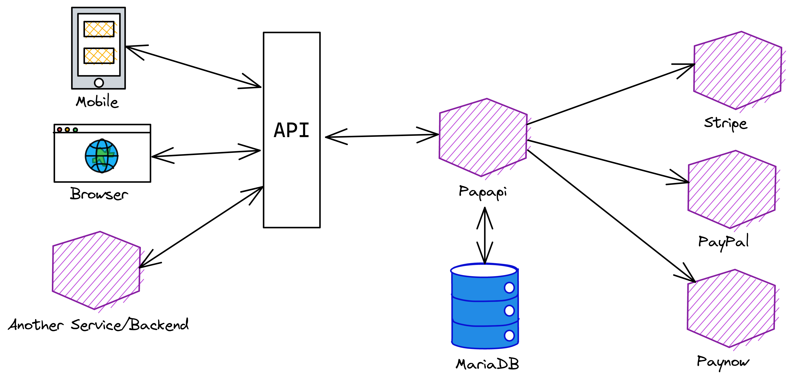

# Papapi

Papapi is a simple, fast, and powerful microservice for **Paynow, PayPal and Stripe** payments.

# Table of contents
1. [Supported Method](#supported-payment-methods)
2. [Tech Stack](#tech-stack)
3. [Architecture](#architecture)
4. [Installation](#installation)
    - [Add a user](#add-a-user)
    - [Get a token](#get-a-token)
    - [Making authenticated requests](#making-authenticated-requests)
5. [Paynow](#paynow)
    - [Recieving Paynow Updates](#recieving-paynow-updates)
6. [Contributing](#contributing)
7. [Special Thanks To](#special-thanks-to)
8. [Sponsorship](#sponsorship)
   


# Supported payment methods
1. Paynow ✅
2. PayPal ❌
3. Stripe ❌

# Tech Stack
1. Feathers JS (https://docs.feathersjs.com/)
2. Sequelize (https://sequelize.org/)
3. MariaDB

# Architecture
Papapi uses a layered architecture




# Installation

1. Clone it

```bash
$ git clone https://github.com/takumade/papapi
```

2. Install dependencies

```bash
$ cd papapi
$ npm install
```
**Note:** You can use yarn or the new bun. If something breaks with the bun, you are on your own.

3. Config your environment variables in `config/default.json` and `config/production.json`

For Paynow look for this object:

```json
"paynow": {
    "email": "",
    "integrationId": "",
    "integrationKey": "",
    "returnUrl": "",
    "resultUrl": "",
    "webhookUrl": "",
}
```

**Note** Dont leave webhookURL empty, If you do so you wont recieve [updates](#recieving-paynow-updates)


4. Run the server

```bash
$ npm run start
```

## Add a user

Send a POST request to `/users` with the following data:

```json
{
  "name": "John Doe",
  "email": "johndoe@email.com",
  "password": "password"
}
```

## Get a token

Send a POST request to `/authentication` with the following data:
    
```json
{
    "stratgey": "password",
    "email": "johndoe@email.com",
    "password": "password"
}
```

## Making authenticated requests

Set the `Authorization` header to the token (accessToken) you got from `/authentication`

```json
{
    "Authorization": "Bearer <token>"
}
```

# Paynow

To create a payment send a POST to `/paynow` with the following data

```json
{
	"email": "<client email>",
	"phone": "<client-phone>",
	"items": [
		{
			"name": "sadza",
			"price": 2.02
		},
		{
			"name": "rice",
			"price": 1.05
		}
	]
}

```

You will get something like this

```json
{
	"id": 23,
	"email": "<client email>",
	"items": "[{\"name\":\"sadza\",\"price\":2.02},{\"name\":\"rice\",\"price\":1.05}]",
	"resultUrl": "<result url>",
	"invoice": "<invoice-id>",
	"paynowReference": "14759100",
	"method": "ecocash",
	"transactionId": "TRX-1657480260658-31e0e07da354d483",
	"instructions": "Dial *151*2*4# and enter your EcoCash PIN. Once you have authorized the payment via your handset, please click Check For Payment below to conclude this transaction",
	"amount": 3.07,
	"pollUrl": "<poll url>",
	"status": "Sent",
	"updatedAt": "2022-07-10T19:11:01.521Z",
	"createdAt": "2022-07-10T19:11:01.521Z"
}
```

## Recieving Paynow Updates
When the transaction status get updated, Papapi will sent a `POST` request to the url you mention in the `webhookURL` field in the paynow settings.

The data will be something like this:

```json
{
    "origin": "papapi",
    "type": "paynow-status-update",
    "data": {
        "id": 23,
        "email": "<client email>",
        "items": "[{\"name\":\"sadza\",\"price\":2.02},{\"name\":\"rice\",\"price\":1.05}]",
        "resultUrl": "<result url>",
        "invoice": "<invoice-id>",
        "paynowReference": "14759100",
        "method": "ecocash",
        "transactionId": "TRX-1657480260658-31e0e07da354d483",
        "instructions": "Dial *151*2*4# and enter your EcoCash PIN. Once you have authorized the payment via your handset, please click Check For Payment below to conclude this transaction",
        "amount": 3.07,
        "pollUrl": "<poll url>",
        "status": "Sent",
        "updatedAt": "2022-07-10T19:11:01.521Z",
        "createdAt": "2022-07-10T19:11:01.521Z"
    },
}
```

# Contributing
My plan is to add the 3 gateways and document them well. Other gateways will be added in future versions. Or If you are stubborn and want to add a new gateway now, please contact me but make sure it doesnt do the same thing as the other gateways.

The last thing I want is end up with a very huge repo with a lot of gateways that does the same thing.

Papapi should be simple and stupid. It should be very good at what it does.

Please see [CONTRIBUTING](CONTRIBUTING.md) for details.


# Special Thanks To
1. [iamngoni](https://github.com/iamngoni) - Papapi uses his version of paynow sdk

# Sponsorship
If you love Papapi, you can really help us by sponsoring us.


# Todo

## Features
- [ ] Address authentication
- [ ] Remove nodemon and uneeded code
- [ ] Clean paynow
- [x] Add paynow mobile
- [ ] Add paynow web
- [ ] Add paypal standard
- [ ] Add paypal advanced
- [ ] Add stripe

## Testing
- [ ] Test stripe
- [x] Test paynow mobile
- [ ] Test paypal advanced
- [ ] Test paynow web
- [ ] Test paypal standard

## Documentation
- [ ] Add paypal example docs
- [ ] Add paypal standard example docs
- [ ] Add paypal advanced example docs
- [ ] Add stripe example docs
- [ ] Add paypal config docs
- [ ] Add paynow config docs
- [ ] Add stripe config docs

## Quality Assurance
- [ ] Write tests for paypal standard
- [ ] Write tests for paypal advanced
- [ ] Write tests for stripe
- [ ] Write tests for paynow mobile
- [ ] Write tests for paynow web

 

To be continued...