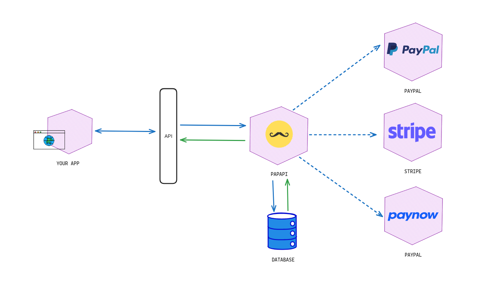

# Papapi

Papapi is a simple, fast, and powerful microservice for **Paynow, PayPal and Stripe** payments.

Think of it a box that is just responsible for handling payments. You can query the transactions, create new ones, and so on. You can get webhooks for PayPal, Stripe, and Paynow status updates.


# Table of contents
- [Papapi](#papapi)
- [Table of contents](#table-of-contents)
- [Supported payment methods](#supported-payment-methods)
- [Tech Stack](#tech-stack)
- [Architecture](#architecture)
- [Installation](#installation)
  - [Add a user](#add-a-user)
  - [Get a token](#get-a-token)
  - [Making authenticated requests](#making-authenticated-requests)
- [Contributing](#contributing)
- [Special Thanks To](#special-thanks-to)
- [Sponsorship](#sponsorship)
- [Todo](#todo)
  - [Features](#features)
  - [Testing](#testing)
  - [Documentation](#documentation)
  - [Quality Assurance](#quality-assurance)
   


# Supported payment methods
1. Paynow ✅
2. PayPal ✅
3. Stripe ✅

# Tech Stack
1. WASP (https://wasp-lang.dev/) [Requires Node 18 and above]

# Architecture
Papapi uses a layered architecture




# Installation

0. Install WASP

```sh
curl -sSL https://get.wasp-lang.dev/installer.sh | sh
```

1. Clone it

```bash
$ git clone https://github.com/takumade/papapi
```

2. Install dependencies

```bash
$ cd papapi
$ wasp
```

3. Config your environment variables in `config/default.json` and `config/production.json`

4. Run the server

```bash
$ wasp start
```

6. To Start a dev database
   
```sh
$ wasp db start
```


If you installed docker as root type this before running `wasp db start`

```sh
$ su - takunda
```

## Add a user

Send a POST request to `/users` with the following data:

```json
{
  "name": "John Doe",
  "email": "johndoe@email.com",
  "password": "password"
}
```

## Get a token

Send a POST request to `/authentication` with the following data:
    
```json
{
    "strategy": "password",
    "email": "johndoe@email.com",
    "password": "password"
}
```

## Making authenticated requests

Set the `Authorization` header to the token (accessToken) you got from `/authentication`

```json
{
    "Authorization": "Bearer <token>"
}
```


# Contributing
My plan is to add the 3 gateways and document them well. Other gateways will be added in future versions. Or If you are stubborn and want to add a new gateway now, please contact me but make sure it doesnt do the same thing as the other gateways.

The last thing I want is end up with a very huge repo with a lot of gateways that does the same thing.

Papapi should be simple and stupid. It should be very good at what it does.

Please see [CONTRIBUTING](CONTRIBUTING.md) for details.


# Special Thanks To
1. [iamngoni](https://github.com/iamngoni) - Papapi uses his version of paynow sdk

# Sponsorship
If you love Papapi, you can really help us by sponsoring us.


# Todo

## Features
- [x] Remove nodemon and uneeded code
- [x] Clean paynow
- [x] Add paynow mobile
- [x] Add paypal standard
- [x] Add stripe
- [x] Add stripe webhooks
- [x] Dockerize app
- [x] Standardize payment status

## Testing
- [x] Test stripe
- [x] Test paynow mobile
- [x] Test paypal standard
- [x] Test stripe webhooks

## Documentation
- [x] Add paypal example docs
- [x] Add paypal standard example docs
- [x] Add stripe example docs
- [x] Add paypal config docs
- [x] Add paynow config docs
- [x] Add stripe config docs

## Quality Assurance
- [ ] Write tests for paypal standard
- [ ] Write tests for stripe
- [ ] Write tests for paynow mobile
- [ ] Add tests for stripe standard
 

To be continued...